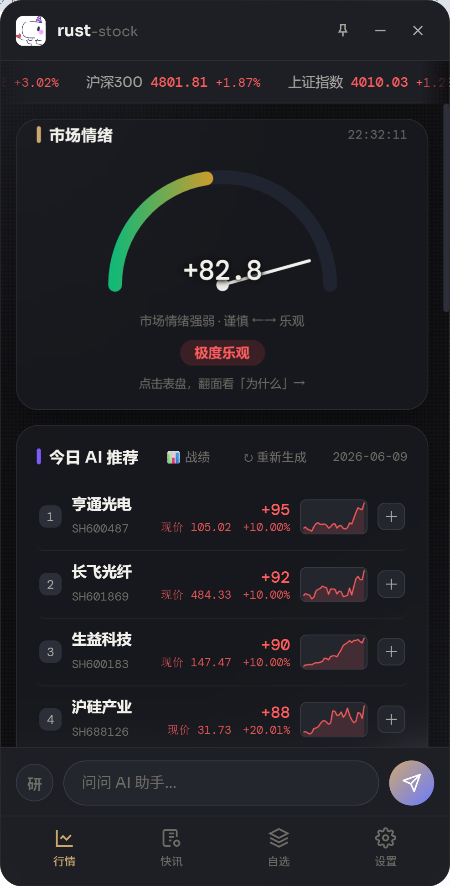
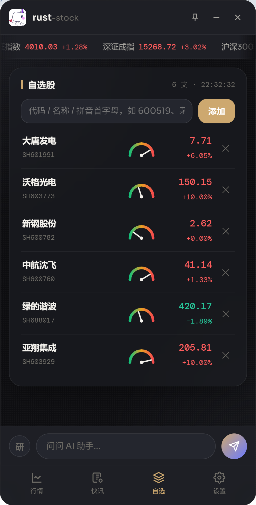
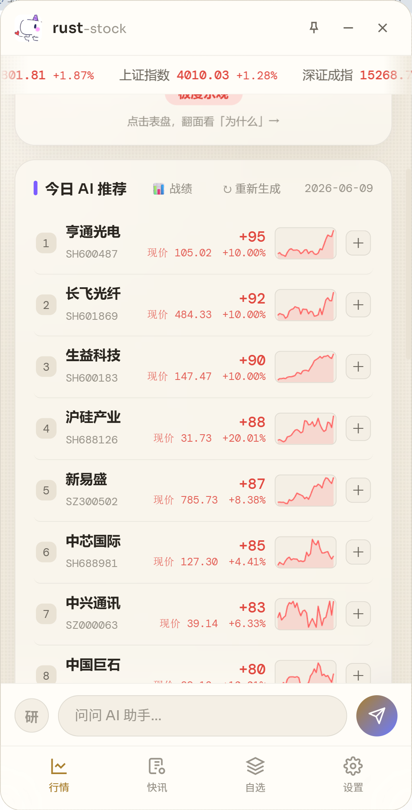
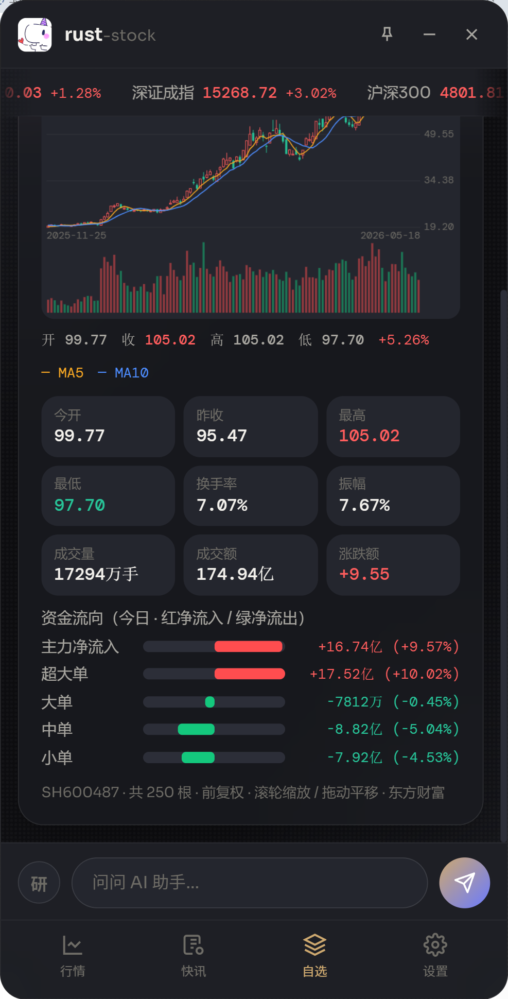
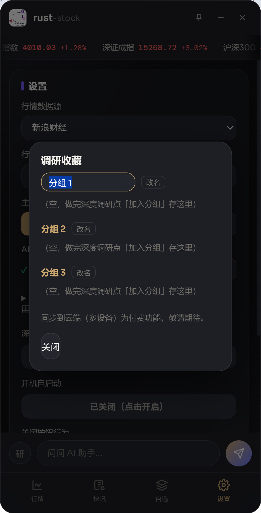
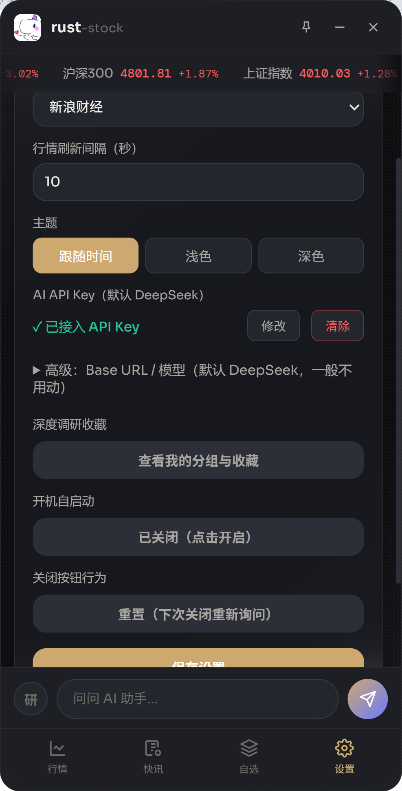

# rust-stock

<p align="center">
  
</p>

<p align="center">
  <b>ヘッジファンドの投資委員会まるごとを、画面の隅のスマホサイズのフローティングウィンドウに詰め込む。</b><br/>
  A株のリアルタイム相場 · 5流派AIコンセンサスエンジン · サプライチェーンのボトルネック特定 · 完全ローカル動作 · デスクトップ + Android
</p>

<p align="center">
  <a href="LICENSE"></a>
  
  
  
  
</p>

<p align="center">
  <a href="README.md">简体中文</a> · <a href="README.en.md">English</a> · <b>日本語</b> · <a href="README.ko.md">한국어</a>
</p>

---

## ⚡ これは何か

他のツールは AI **1つ**の意見をくれる。rust-stock は **バリュー・グロース・短期資金・テクニカル・マクロ** の5つの流派の AI アナリストを同じ舞台で議論させ、ヘッジファンドの投資委員会のように **総合的に裁定** する。しかもそれは、デスクトップやスマホの隅にある 360×640 のすりガラス風フローティングウィンドウ——画面の端にドラッグすると自動で吸着して収納される——にすぎない。赤が上昇・緑が下落（A株の慣習）、**完全ローカル動作・サーバー不要**、データは自分の端末から出ない。

デスクトップ（Windows / macOS）と Android は **同一ソース・同一体験**。

> ⚠️ すべての AI 出力は **リサーチの順位付けと発想の参考であり、投資助言ではありません**。市場にはリスクがあり、判断は自己責任で。

## 🧠 意思決定エンジン：「AIに上がるか聞く」のではなく、一つの方法論

「今日の AI 推奨」の中核は **実データ → マルチエージェント裁定 → 相場再確認** というパイプラインで、2つの優れた公開手法を融合している。

**① ローカルでの全市場スキャン（実データ、AI は捏造しない）**
毎日まず自分の端末で実相場から候補プールを選別：**値上がり率上位 + 主力資金純流入上位 + 龍虎榜（大口取引ランク）掲載** を統合・重複除去し、現在値／騰落率／回転率／主力純額／掲載の有無を付与。AI に渡すのは確固たる実数値だけで、「相場の幻覚」を源から断つ。

**② サプライチェーンのボトルネック研究法（土台）— [muxuuu/serenity-skill](https://github.com/muxuuu/serenity-skill) を参考**
市場のナラティブを **体系的な物理的制約** に翻訳する：産業チェーンを8層に分解（川下需要 → システム統合 → モジュール → チップ → プロセス・実装 → 装置・検査 → 材料・消耗品 → インフラ）し、最も **ボトルネックとなる希少な層**（サプライヤ集中度／認証期間／増産難度／工程障壁）を突き止め、その層を **支配** しているのは誰かを特定する。
> **採用理由**：テーマは煽られ、物語は変わるが、生産能力・歩留まり・認証といった物理的ボトルネックは嘘をつかない。サプライチェーンの実制約に錨を下ろすことで、感情を追うのではなく、価値が本当に沈殿する箇所を見つけられる。

**③ 多流派コンセンサス採点（裁定）— [virattt/ai-hedge-fund](https://github.com/virattt/ai-hedge-fund) を参考**
各候補について、5つの投資流派の AI 視点が **各自独立に採点し、その上で仲裁** する：

| 流派 | 注目点 |
|---|---|
| 💎 バリュー | 堀（参入障壁）、バリュエーションの安全域 |
| 🚀 グロース | 業界のSカーブ、TAM の天井 |
| 🔥 短期資金 | テーマ過熱、龍虎榜、出来高・回転率 |
| 📈 テクニカル | トレンド、ブレイク、移動平均構造 |
| 🌐 マクロ | 政策、資金面、流動性 |

> **採用理由**：ai-hedge-fund の真髄は「複数の投資家エージェント + 仲裁」。単一視点には必ず死角がある。複数の専門流派にまず議論させ、相違を浮かび上がらせリスクを露出させる方が、「上がるか?」と聞くよりはるかに信頼できる。

**④ 銘柄ごとの深掘りリサーチ + 実相場の再確認**
2段階で出力：まず6〜8銘柄を一次選抜し、次に **選ばれた各銘柄について個別にサプライチェーン8層の深掘り**（「研究」ボタンと同源：チェーン上の位置／ボトルネックと希少性／5流派の強気弱気／カタリストと検証／リスク／反証／リサーチ優先度）を行い、推奨理由に統合する（並行実行で所要時間を制御）。その後すべての価格／騰落率は実相場で **埋め戻し**（AI の数値捏造を禁止）、幻覚コードや **6営業日連続で日々下落（6連続陰線）** の銘柄は除外。各銘柄に付随：**チェーン上の位置／5流派の相違／龍虎榜の資金シグナル／本日の注目点／主なリスク／反証条件**。

> 一言で：**実データを土台に、サプライチェーンのボトルネックで方向を定め、5流派で取捨を決め、実相場で担保する。** ストップ高を煽らず、推奨銘柄を叫ばず、根拠のあるリサーチ順位付けだけを行う。

## 📊 ほかにできること

- **市場センチメント計**：主要4指数（上海総合／深セン成分／創業板／滬深300）の騰落率加重 + tanh 圧縮を、-100〜100 の針にリアルタイム反映；クリックで3D反転し計算明細 + AI による相場解説を表示。
- **ウォッチリストのAI健診**：各銘柄の横にミニ計器、AI が -100〜+100 で強気弱気を採点；タップでサプライチェーン式の詳細理由。
- **推奨サムネイル**：各推奨銘柄の後ろに実データの「直近30日終値ライン」、ワンタップで日足チャートへ。
- **チャート／資金フロー／チップ分布／テクニカル指標**：日／週／月足ローソク + MA5/MA10 + 出来高；通達信式の MACD/KDJ/RSI/BOLL の現値とゴールデン／デッドクロス；個別銘柄の資金フロー5段階（主力／超大口／大口／中口／小口、赤=流入・緑=流出）；**チップ分布図**——回転率減衰 + コスト中枢のガウスカーネルで各価格帯のチップ堆積を近似（赤=含み益玉／緑=含み損玉）、含み益比率／平均コスト／現在値を直読。
- **AIストリーミングチャット + 深掘りリサーチ + お気に入り**：下部バーが DeepSeek から1文字ずつストリーミング；「研究」ボタンで8層サプライチェーンの深掘りワークフローへ；結論は **グループに保存** でき、全文または項目単位でコピー、端末に永久保存。
- **取引時間外の表示**：A株が寄り前／昼休み／引け後／週末のとき、相場バー下の赤帯が「前営業日のデータを継続表示」と明示し、古いデータをリアルタイムと誤認させない。
- **成績バックテスト**：過去の推奨をチャートで再計算し勝率と1件あたりリターンを算出、エンジンが自らを監督。

## 🖼️ スクリーンショット

> デスクトップ + Android 同一ソース；すりガラス2テーマ（昼=クリーム白／夜=純黒）。スクリーンショットは随時更新。

| 相場ホーム | ウォッチリスト + AI計器 | 今日のAI推奨 |
|:---:|:---:|:---:|
|  |  |  |

| チャート + 資金フロー | リサーチお気に入り | 設定 |
|:---:|:---:|:---:|
|  |  |  |

## ✨ 機能一覧

- **フローティングウィンドウ体験（デスクトップ）**：枠なし角丸の最前面ミニウィンドウ、タイトルバーでドラッグ、画面端で自動吸着；✕ で右側の縦型計器ウィジェットに収納、再クリックで展開；自由にリサイズ可能。
- **Android ネイティブ**：同じ UI を Android アプリとして実行——チャートのピンチズーム／パン、システムの戻るジェスチャで前ページへ、フルスクリーンノッチ対応、ブランドの起動アイコン。
- **2系統の相場ソース**：新浪財経／東方財富を切替・相互冗長；シームレスな指数ティッカー；コードまたは名称／ピンインで銘柄を追加削除。
- **完全ローカル永続化**：バンドル SQLite、ウォッチリスト／設定／AIキャッシュをすべて保存、単一ファイルで移行可；中継サーバーなし、データは端末内のみ。
- **任意のAIを接続**：既定は DeepSeek、Base URL／モデルは任意の OpenAI 互換サービス（Kimi、通義、ローカル Ollama…）に変更可；キーは端末内のみに保存。
- **リキッドグラス外観（実験的・設定で任意）**：iOS「Liquid Glass」風のすりガラス——半透明 + ぼかし + ハイライト縁取り + オーロラ背景 + フローティングピルタブ、昼夜対応；既定はオフ、古い Android では不透明に自動降格。

[ArvinLovegood/go-stock](https://github.com/ArvinLovegood/go-stock)（Wails + Go）の完全ローカル形態を参考に、Tauri 2（Rust + システム WebView）で再構築。Electron 系よりバンドルサイズもメモリも大幅に小さい。

## クイックスタート

### 環境（一度だけ）

- [Rust ツールチェーン](https://rustup.rs)（Windows は VS Build Tools の「C++ によるデスクトップ開発」、macOS は Xcode CLT が必要）
- Windows 10 は [WebView2 ランタイム](https://developer.microsoft.com/microsoft-edge/webview2/) が必要な場合あり（Win11 は標準搭載）
- Tauri CLI：`cargo install tauri-cli --version "^2"`

### 実行

```bash
cd rust-stock
cargo tauri dev      # 開発（フロントのホットリロード）
cargo tauri build    # インストーラ作成（Windows NSIS / macOS dmg）
```

### フロントのみプレビュー（Rust 不要）

```bash
cd rust-stock/src && python3 -m http.server 8080
# ブラウザで http://localhost:8080 ; データはモック
```

### テスト

```bash
cd rust-stock/src-tauri && cargo test
# 範囲：相場解析（新浪/東財）、ニュース解析、センチメント算法、SQLite KV
```

## AI の設定（任意）

設定画面で API キーを入力（既定は [DeepSeek](https://platform.deepseek.com)；Base URL／モデルは Kimi・通義・ローカル Ollama など任意の OpenAI 互換サービスに変更可）。キーは端末内の SQLite にのみ保存され直接接続。設定するとウォッチリストの AI 採点、センチメントの AI 解説、AI チャットが有効化；未設定でも丁寧に降格し案内を表示。

## プロジェクト構成

```
rust-stock/
├── src/                       # フロント（素の HTML/CSS/JS + ES modules、フレームワーク/ビルドなし）
│   ├── index.html             # 全 UI（スタイルはインライン）
│   ├── main.js                # ブートストラップ（配線/タイマー）
│   └── js/
│       ├── bridge.js          # Tauri ブリッジ（ブラウザプレビュー降格）
│       ├── store.js           # グローバル状態 + SQLite/localStorage 永続化
│       ├── api.js             # Tauri コマンドのラッパ
│       ├── ui.js / router.js  # 共通部品 / ページ切替
│       └── pages/             # 相場 / ニュース / ウォッチリスト / チャット / 設定
├── src-tauri/                 # Rust ローカルロジック層
│   ├── src/lib.rs             # Tauri コマンド層（業務プロンプト / ウィンドウ制御）
│   ├── src/sources/           # 相場ソース抽象（QuoteSource trait + レジストリ）
│   ├── src/ai.rs              # AI プロバイダ抽象（OpenAI 互換、base_url/model 可変）
│   ├── src/quote.rs           # 相場モデルとパーサ（単体テスト付き）
│   ├── src/feed.rs            # ニュース + センチメント算法（単体テスト付き）
│   ├── src/storage.rs         # SQLite KV 永続化（単体テスト付き）
│   └── tauri.conf.json        # ウィンドウ / パッケージ設定
└── docs/                      # 開発ドキュメント
```

完全な更新履歴は **[中文 README → 更新日志](README.md#更新日志)**（新しい順）に。

詳細：[開発ドキュメント](rust-stock/docs/DEVELOPMENT.md)

## 免責事項

相場とニュースのデータは第三者の公開 API（新浪財経、東方財富）に由来し、学習・研究目的のみ。商用前にライセンスを各自で確認のこと。AI の分析はモデル生成であり参考のみ、投資助言ではありません。投資にはリスクが伴います、慎重に。

## 謝辞

- [ArvinLovegood/go-stock](https://github.com/ArvinLovegood/go-stock) — 本プロジェクトの着想源
- [Tauri](https://tauri.app) · [DeepSeek](https://deepseek.com)

## ライセンス

[Apache License 2.0](LICENSE)
